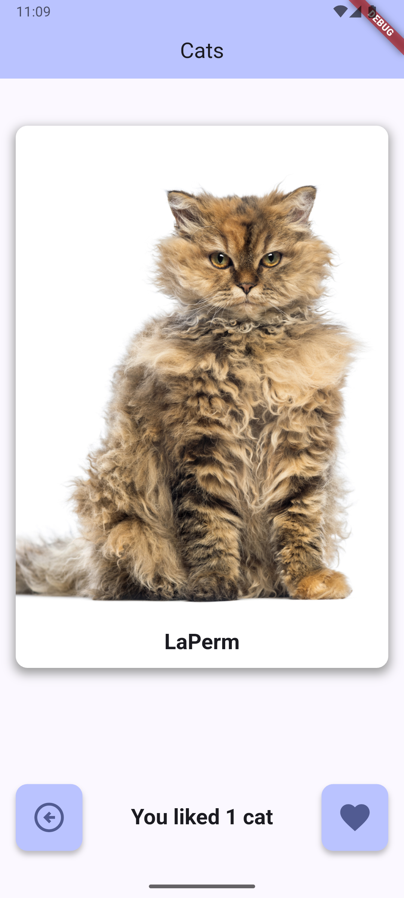
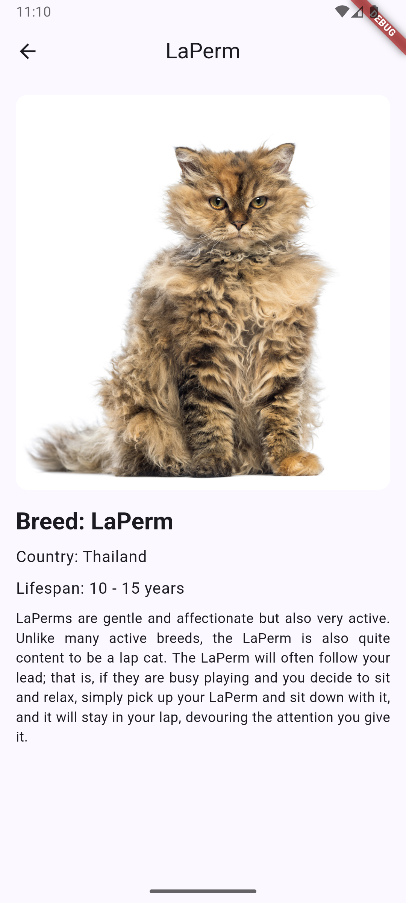

# cat_tinder

Тиндер для котов.

## Список фич
* На главном экране изображение кота
* Кота можно свайпнуть вправо или влево
* Есть счетчик лайков
* При нажатии на кота, открывается экран с детальным описанием

## Технические детали
* Для запросов в [https://thecatapi.com](https://thecatapi.com) использован пакет http
* Случайная картинка кота получается через endpoint /search
* Изображение кота получается только если указана порода
* Использован Navigator для открытия детального экрана
* Использованы виджеты Row и Column
* Использованы Statful и Stateless виджеты
* Кнопки лайка и дизлайка - отдельные компоненты, сделанные на StatelessWidget
* Сделана кастомная иконка приложения

## Скриншоты

