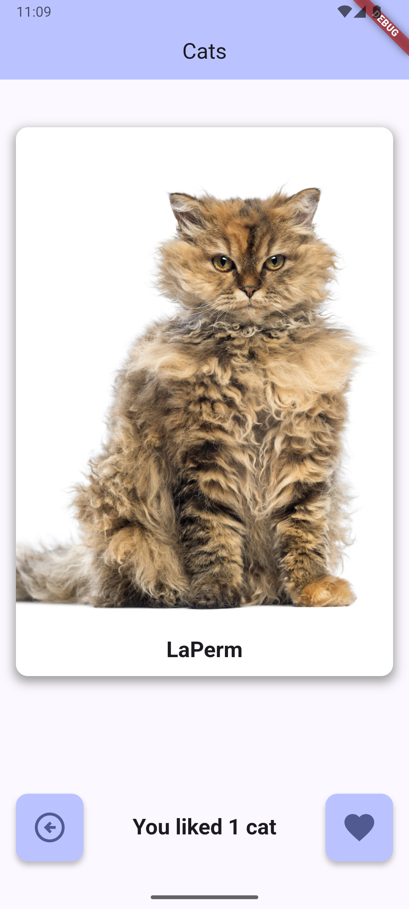
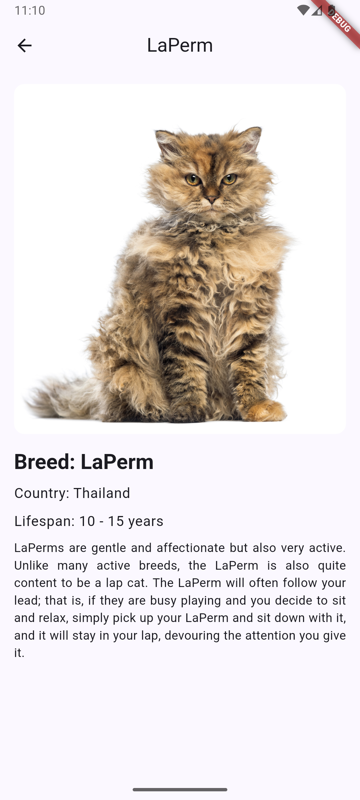
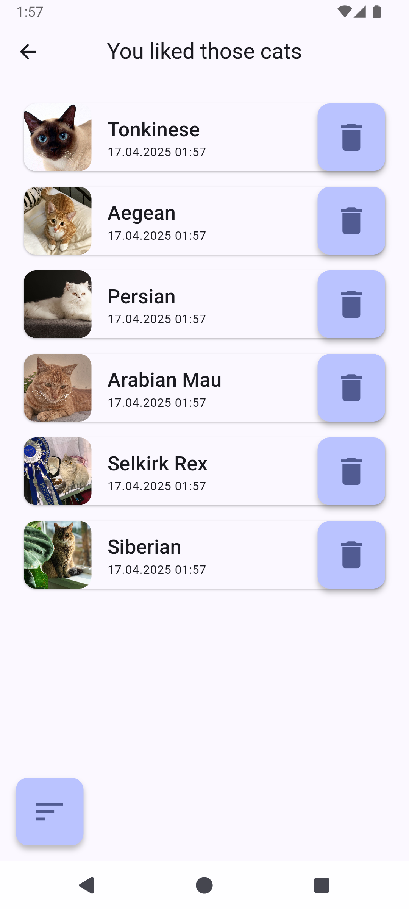
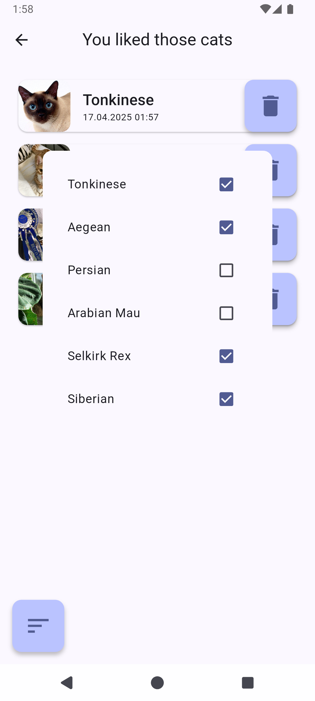
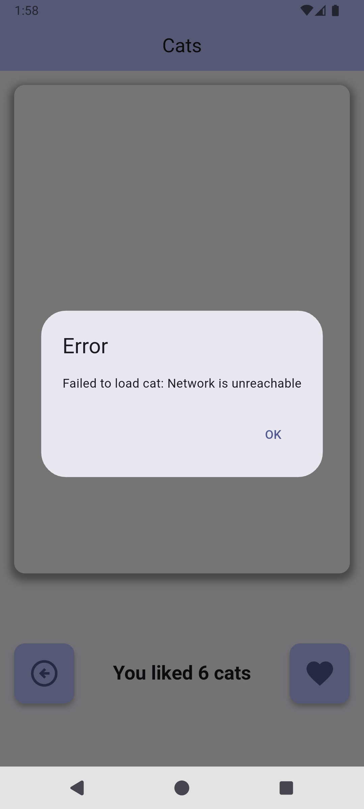

# cat_tinder

Тиндер для котов.

[Скачать apk](https://drive.google.com/file/d/1R8pgz_oZw4KYSddko50GGN4ApXv6ZoEb/view?usp=sharing)

## Список фич
* На главном экране изображение кота
* Кота можно свайпнуть вправо или влево
* Есть счетчик лайков
* При нажатии на кота, открывается экран с детальным описанием
* При нажатии на счетчик лайков, открывается экран с историей лайкнутых котов
* В списке истории есть возможность фильтровать записи и удалять их
* При фильтрации/удалении краточек в истории изменения происходят мгновенно
* При длительной загрузке показывается progress bar.
* При ошибке сети отображается диалог с ошибкой
* Данные сохраняются при выходе из приложения

## Технические детали
* Для запросов в [https://thecatapi.com](https://thecatapi.com) использован пакет http
* Случайная картинка кота получается через endpoint /search
* Изображение кота получается только если указана порода
* Использован Navigator для открытия детального экрана
* Использованы виджеты Row и Column
* Использованы Statful и Stateless виджеты
* Кнопки лайка и дизлайка - отдельные компоненты, сделанные на StatelessWidget
* Сделана кастомная иконка приложения
* Декомпозиция на слои Data, Domain, Presentation (Поскольку в этом проекте entities из слоя Domain полностью повторяли бы устройство models из слоя Data и хранили бы один и тот же набор данных, было принято решение не разделять их)
* State management с помощью Bloc
* Использование get_it для DI
* CircularProgressionIndicator для отображения загрузки
* AlertDialog для отображения ошибки сети
* Использован connectivity_plus для проверки наличия сети и snackbar для отображения статуса
* Добавлено кэширования изображений через cached_network_image
* Локальное хранилище на Drift

## Скриншоты

